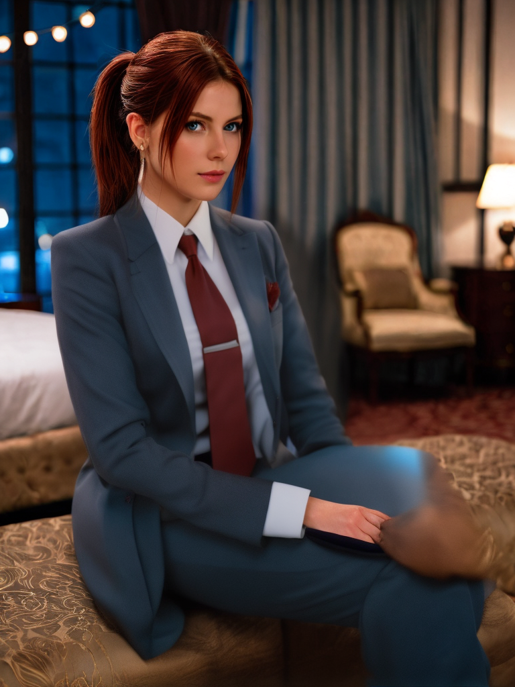

# 🎨 AI-Avtaar

**An End-to-End Character & Virtual Try-On Pipeline**

Transform a handful of images into a consistent AI character, generate stunning photos, and virtually try on different clothing items—all through a unified, intuitive interface.

---

## 🌟 Overview

AI-Avtaar is a complete pipeline that seamlessly integrates three powerful AI engines into a single Streamlit application. The system enables you to:

1. **Train** a custom character model (LoRA) from your photos
2. **Generate** new images featuring your character
3. **Apply** virtual clothing try-ons with photorealistic results

### Architecture at a Glance

The pipeline orchestrates three specialized backend engines:

- **LoRA Training Engine** — Automated model training using Kohya_ss
- **Image Generation Engine** — AI image creation via Automatic1111 (A1111)
- **Virtual Try-On Engine** — Realistic clothing application with CatVTON

Each component runs in its own isolated virtual environment, ensuring clean dependency management and stability.

---

## 📸 Screenshots

<div align="center">

### Web Application Interface

<table>
  <tr>
    <td align="center">
      
      <br />
      <b>LoRA Training Interface</b>
    </td>
    <td align="center">
      
      <br />
      <b>Image Generation Interface</b>
    </td>
  </tr>
  <tr>
    <td align="center">
      
      <br />
      <b>Virtual Try-On Interface</b>
    </td>
    <td align="center">
      
      <br />
      <b>Results Dashboard</b>
    </td>
  </tr>
</table>

### Virtual Try-On Results

<table>
  <tr>
    <td align="center">
      
    </td>
    <td align="center">
      
    </td>
    <td align="center">
      
    </td>
  </tr>
  <tr>
    <td align="center"><i>Casual Wear</i></td>
    <td align="center"><i>Formal Attire</i></td>
    <td align="center"><i>Outerwear Style</i></td>
  </tr>
</table>

</div>

---

## ✨ Key Features

| Feature | Description |
|---------|-------------|
| **Unified Interface** | Single Streamlit app controls the entire pipeline |
| **Zero-Config Training** | No manual folder setup or parameter tuning required |
| **Live Training Logs** | Real-time monitoring with persistent log viewing |
| **Seamless Workflow** | Train → Generate → Try-On in one continuous flow |
| **Multi-Environment** | Isolated venvs prevent dependency conflicts |

---

## 🏗️ Project Structure

```
AI-avtaar/
│
├── 📁 datasets/                      # Trained LoRA models & prepared datasets
│
├── 📁 image-gen/                     # Automatic1111 installation
│   ├── a1111-venv/                   # A1111 virtual environment
│   └── stable-diffusion-webui/       # A1111 repository
│
├── 📁 KOHYA_SS/                      # Kohya_ss training engine
│   ├── Kohya-venv/                   # Kohya virtual environment
│   └── kohya_ss/                     # Kohya repository
│       └── models/                   # ⚠️ Place base SDXL models here
│
├── 📁 LoRA-pipeline/                 # Main Streamlit application
│   ├── pipeline-venv/                # Streamlit virtual environment
│   ├── pages/                        # Application pages
│   │   ├── 1_Train_LoRA.py          # Training interface
│   │   ├── 2_Image_Generation.py    # Generation interface
│   │   └── 3_Virtual_Try-On.py      # Try-on interface
│   ├── app.py                        # Homepage entry point
│   ├── captioning.py                 # Image captioning utilities
│   ├── dataset_preparation.py        # Dataset preprocessing
│   ├── training.py                   # Training launcher
│   └── SDXL_Preset.json             # Training configuration
│
├── 📁 Regularization_images/         # Regularization source images
│
└── 📁 Vton/                          # Virtual Try-On installation
    ├── vton-venv/                    # VTON virtual environment
    └── Virtual-TryOn/
        └── vto-backend/              # FastAPI backend service
```

---

## 🔧 Tech Stack

### Core Technologies

- **Orchestration:** Streamlit, Python 3.10+
- **Training:** Kohya_ss, Accelerate, Diffusers, PyTorch
- **Generation:** Stable Diffusion WebUI (A1111)
- **Try-On:** CatVTON, FastAPI

### Requirements

- **GPU:** NVIDIA GPU with 16GB+ VRAM (recommended)
- **Software:** CUDA Toolkit, Python 3.10+, Git
- **OS:** Linux (recommended) or Windows with WSL

---

## 🚀 Installation Guide
> **📦 Note:** This repository does not include sample datasets or the complete Vton folder due to size constraints. If you need these resources for testing or development, please contact me via email: **your.itsnits333@example.com**

### Step 1: Clone the Repository

```bash
git clone <your-repo-url>
cd AI-avtaar
```

### Step 2: Set Up Virtual Environments

The pipeline requires **four separate virtual environments**. Follow these steps carefully:

#### 🔹 Environment 1: Streamlit Application

```bash
cd LoRA-pipeline
python3 -m venv pipeline-venv
source pipeline-venv/bin/activate  # On Windows: pipeline-venv\Scripts\activate
pip install -r requirements.txt
deactivate
cd ..
```

#### 🔹 Environment 2: Kohya_ss Training Engine

```bash
cd KOHYA_SS
python3 -m venv Kohya-venv
source Kohya-venv/bin/activate  # On Windows: Kohya-venv\Scripts\activate
cd kohya_ss
./setup.sh  # Follow Kohya_ss installation prompts
deactivate
cd ../..
```

#### 🔹 Environment 3: A1111 Image Generation

```bash
cd image-gen
python3 -m venv a1111-venv
source a1111-venv/bin/activate  # On Windows: a1111-venv\Scripts\activate
cd stable-diffusion-webui
pip install -r requirements.txt
deactivate
cd ../..
```

#### 🔹 Environment 4: Virtual Try-On Backend

```bash
cd Vton
python3 -m venv vton-venv
source vton-venv/bin/activate  # On Windows: vton-venv\Scripts\activate
cd Virtual-TryOn
pip install -r requirements.txt
deactivate
cd ../..
```

### Step 3: Install Base Models

> ⚠️ **CRITICAL STEP** — The pipeline will not function without proper model placement.

The SDXL base model must be placed in **two locations**:

#### For Training (Kohya_ss):

1. Place your base model (e.g., `CyberRealisticXLPlay_V6.0.safetensors`) in:
   ```
   AI-avtaar/KOHYA_SS/kohya_ss/models/
   ```

2. **IMPORTANT:** Create a converted `_diffusers` version in the same directory:
   ```bash
   # This conversion is required by training.py
   # Follow Kohya_ss documentation for conversion
   ```

#### For Generation (A1111):

Place the same `.safetensors` model in:
```
AI-avtaar/image-gen/stable-diffusion-webui/models/Stable-diffusion/
```

---

## 🎯 Running the Pipeline

The pipeline requires **three backend services** running simultaneously before launching the main application.

### Terminal 1: Start A1111 Server

```bash
cd AI-avtaar/image-gen/
source a1111-venv/bin/activate  # On Windows: a1111-venv\Scripts\activate
cd stable-diffusion-webui/
python launch.py --listen --api
```

**Status:** Server should start on `http://localhost:7860`  
**Action:** Keep this terminal running

---

### Terminal 2: Start VTON Backend

```bash
cd AI-avtaar/Vton/
source vton-venv/bin/activate  # On Windows: vton-venv\Scripts\activate
cd Virtual-TryOn/vto-backend/
uvicorn backend_main:app --host 0.0.0.0 --reload
```

**Status:** API should start on `http://localhost:8000`  
**Action:** Keep this terminal running

---

### Terminal 3: Launch Streamlit App

```bash
cd AI-avtaar/LoRA-pipeline/
source pipeline-venv/bin/activate  # On Windows: pipeline-venv\Scripts\activate
streamlit run app.py
```

**Status:** Browser will automatically open to `http://localhost:8501`  
**Action:** The application is now ready to use!

---

## 📖 Usage Workflow

### 1️⃣ Train Your Character LoRA

1. Navigate to **"1_Train_LoRA"** page
2. Enter a unique character name (e.g., `my_character`)
3. Upload 5-20 high-quality images of the person
4. Click **"Start Full Training Pipeline"**
5. Monitor live logs as the system:
   - Generates captions for your images
   - Prepares the training dataset
   - Trains the LoRA model

**Training Time:** 30-60 minutes (depending on GPU)

---

### 2️⃣ Generate Custom Images

1. Navigate to **"2_Image_Generation"** page
2. Click **"Refresh"** to load your newly trained LoRA
3. Select your LoRA from the dropdown
4. Enter the trigger word (e.g., `my_character`)
5. Write a creative prompt describing the desired scene
6. Click **"Generate Image"**

**Example Prompt:**
```
my_character wearing a blue shirt, professional photo shoot, 
studio lighting, high quality, detailed face
```

---

### 3️⃣ Virtual Try-On

1. Navigate to **"3_Virtual_Try-On"** page
2. Upload your generated image as the **Model Image**
3. Upload a clothing item (t-shirt, jacket, dress) as **Clothing Image**
4. Select the appropriate **clothing category**
5. Click **"Generate Virtual Try-On"**

**Result:** Photorealistic clothing application on your character

---

## 🐛 Troubleshooting

### Common Issues

| Issue | Solution |
|-------|----------|
| **"CUDA out of memory"** | Reduce batch size in `SDXL_Preset.json` or use a GPU with more VRAM |
| **"Model not found"** | Verify base model is placed in both required locations |
| **"API connection refused"** | Ensure all three backend services are running |
| **"Import errors"** | Verify you're using the correct virtual environment for each component |

### Getting Help

If you encounter issues:
1. Check that all three backend services are running
2. Verify all virtual environments are properly activated
3. Ensure base models are correctly placed
4. Review terminal logs for error messages

---

## 📝 License

This project is licensed under the **MIT License**. See the [LICENSE](LICENSE) file for full details.

---

## 🙏 Acknowledgments

This pipeline integrates several open-source projects:

- [Kohya_ss](https://github.com/bmaltais/kohya_ss) - LoRA training
- [Automatic1111](https://github.com/AUTOMATIC1111/stable-diffusion-webui) - Image generation
- [CatVTON](https://github.com/Zheng-Chong/CatVTON) - Virtual try-on
- [Streamlit](https://streamlit.io/) - Web interface

---

<div align="center">

**Built with ❤️ for AI creators and developers**

⭐ Star this repo if you find it useful!

</div>